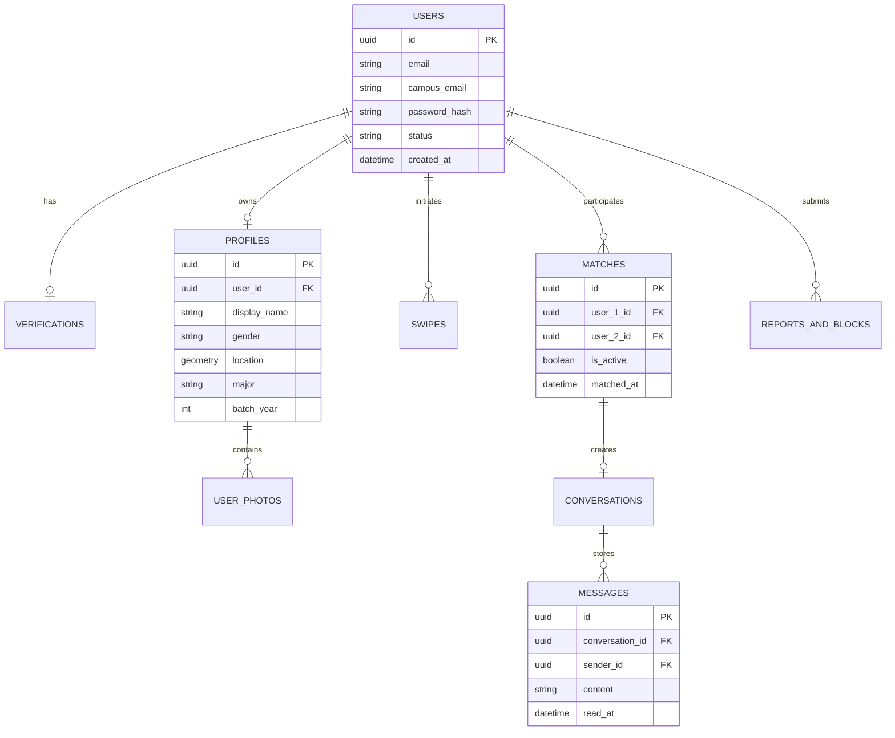

# 📄 DOKUMEN BRIEF ARSITEKTUR BACKEND PROPER: PLATFORM DAPAJO (CAMPUS MATCH)

---

## 📌 1. Ringkasan Eksekutif & Pola Arsitektur

DAPAJO adalah platform PWA *campus match & student networking* berbasis lokasi, verifikasi identitas mahasiswa, matching (*swipe system*), dan *real-time chat*.

### Pola Arsitektur Rekomendasi
**Modular Monolith (berbasis TypeScript/NestJS atau Go)** untuk fase MVP hingga 100k MAU. Struktur kode terisolasi per modul domain agar dapat dimigrasi dengan mudah ke *Microservices* saat skala pengguna berkembang pesat.

### Protokol Komunikasi
- **REST API / gRPC:** Digunakan untuk operasi CRUD, Autentikasi, Profil, dan Swipe engine.
- **WebSockets (WSS):** Digunakan untuk *Real-time Direct Messaging*, *Typing Indicator*, dan Status Kehadiran (*Online Presence*).
- **Server-Sent Events (SSE) / Web Push API:** Digunakan untuk Notifikasi *Push* PWA (Match baru, pesan masuk, peringatan keamanan).

---

## 🛠 2. Tech Stack Rekomendasi (Production-Grade)

| Komponen | Teknologi Terpilih | Alasan & Keunggulan |
| :--- | :--- | :--- |
| **Primary Language & Framework** | **TypeScript + NestJS** (atau **Go + Fiber**) | Type-safety terintegrasi penuh dengan Frontend Next.js/TS. Arsitektur NestJS sangat terstruktur (*Dependency Injection*, Modules). Go cocok jika mengutamakan *throughput concurrency* sangat tinggi. |
| **Primary Database** | **PostgreSQL (v16+) + PostGIS** | Sangat andal untuk transaksi ACID (match, user relation). Ekstensi **PostGIS** menangani query spasial/geolokasi (*Nearby Students*) dengan presisi & performa tinggi. |
| **ORM / Query Builder** | **Prisma ORM** atau **Drizzle ORM** | Type-safe database client, migrasi skema terstruktur, & *developer experience* yang cepat. |
| **Caching & In-Memory Store** | **Redis Stack** | Digunakan untuk: Rate limiting, Redis Geo (caching lokasi cepat), Pub/Sub WebSocket horizontal scaling, Session/Token Blacklisting. |
| **Real-time Engine** | **Socket.io + Redis Adapter** | Kemudahan penanganan fallback, room management, dan autoscaling WebSocket server dengan Redis Pub/Sub. |
| **File & Media Storage** | **Cloudflare R2** / **AWS S3** + **ImageKit / Cloudflare Images** | Penyimpanan foto profil & voice notes murah tanpa biaya *egress*. Auto-crop, kompresi WebP, & CDN global. |
| **Push Notification** | **Firebase Cloud Messaging (FCM) + Web Push API** | Notifikasi PWA native di Android & iOS Safari (iOS 16.4+). |
| **Content Moderation / AI** | **AWS Rekognition** / **OpenAI Vision API** | Auto-moderation foto profil dari konten sensitif/NSFW sebelum dipublikasikan. |

---

## 🗄 3. Perancangan Skema Basis Data (Database Blueprint)



### Detail Tabel:

#### A. Tabel Core & Auth (`users`, `verifications`, `profiles`)
- **`users`**: `id (UUID)`, `email`, `campus_email` (`.ac.id`), `phone_number`, `password_hash`, `role`, `status` (`pending_verification`, `active`, `suspended`), `created_at`, `updated_at`.
- **`verifications`**: `id`, `user_id (FK)`, `ktm_image_url`, `student_number (NIM)`, `status` (`pending`, `approved`, `rejected`), `verified_at`, `rejection_reason`.
- **`profiles`**: `id`, `user_id (FK)`, `display_name`, `gender`, `target_gender_preference`, `birth_date`, `university_id`, `major`, `batch_year`, `bio`, `voice_note_url`, `location (GEOMETRY Point / PostGIS)`, `is_location_visible`, `updated_at`.
- **`user_photos`**: `id`, `profile_id (FK)`, `photo_url`, `sort_order`, `is_primary`, `is_verified`.

#### B. Tabel Match & Interaction (`swipes`, `matches`)
- **`swipes`**: `id`, `swiper_id (FK users)`, `target_id (FK users)`, `action` (`like`, `pass`, `superlike`), `created_at`. Unique index pada `(swiper_id, target_id)`.
- **`matches`**: `id`, `user_1_id (FK users)`, `user_2_id (FK users)`, `matched_at`, `is_active`, `unmatched_by`, `unmatched_at`. Unique index pada `(LEAST(user_1_id, user_2_id), GREATEST(user_1_id, user_2_id))`.

#### C. Tabel Messaging & Moderation (`conversations`, `messages`, `reports`)
- **`conversations`**: `id`, `match_id (FK matches)`, `last_message_at`, `created_at`.
- **`messages`**: `id`, `conversation_id (FK)`, `sender_id (FK)`, `content`, `media_url`, `type` (`text`, `image`, `voice`), `read_at`, `created_at`.
- **`reports_and_blocks`**: `id`, `reporter_id (FK)`, `reported_id (FK)`, `reason`, `description`, `evidence_photo_url`, `created_at`.

---

## 🧩 4. Modul Utama & Alur Eksekusi Sistem

### 1️⃣ Modul Auth & Verifikasi Kampus (Campus Auth Engine)
- **Registrasi & Verifikasi Email Kampus (`.ac.id`):**
  - Mengirimkan OTP/Link ke email kampus mahasiswa.
  - Upload foto KTM diproses via OCR/Vision API + Dashboard Admin Review Panel.
- **Token Management:**
  - `Access Token` (JWT short-lived: 15-30 menit).
  - `Refresh Token` (HTTP-only secure cookie, long-lived: 7-30 hari, disimpan terenkripsi di Redis).

### 2️⃣ Modul Swipe & Match Engine (High Performance Matcher)
- **Mekanisme Swipe Optimistik:**
  1. Ketika User A me-LIKE User B: simpan record di `swipes`.
  2. Cek Redis/Postgres apakah ada reverse swipe (`swiper_id = B` & `target_id = A` & `action = like`).
  3. **Jika Match:**
     - Buat row baru di `matches` dalam DB Transaction.
     - Buat `conversation_id` otomatis.
     - Emit event via WebSocket ke User A & User B (`MATCH_EVENT`).
     - Trigger Push Notification ke kedua user: *"It's a Match!"*.

### 3️⃣ Modul Nearby & Geolokasi (Spatial Query Engine)
- **Penyimpanan Lokasi:**
  - Koordinat GPS (`latitude`, `longitude`) diupdate secara periodik ke PostGIS (`ST_SetSRID(ST_MakePoint(lon, lat), 4326)`) dan cached di **Redis Geo** (`GEOADD campus_users lon lat user_id`).
- **Query Nearby:**
  - Menggunakan query Redis `GEORADIUS` / PostGIS `ST_DWithin` untuk mendapatkan user dalam radius X km (misal 1–15 km) dari lokasi kampus / keberadaan mahasiswa.
  - Filter tambahan: `gender_preference`, `batch_year`, `major`, dan exclusion user yang sudah di-swipe.

### 4️⃣ Modul Real-Time Chat & Signaling (WebSocket Engine)
- **Arsitektur WebSocket:**
  - Koneksi disahkan via JWT handshake.
  - Redis Adapter memfasilitasi komunikasi antar-node backend apabila di-deploy secara terdistribusi.
- **Event Flow Chat:**
  - `send_message`: Simpan pesan ke DB `messages` -> Push ke penerima via WS jika online -> Jika offline, trigger FCM Push Notification.
  - `typing_start` / `typing_stop`: Event in-memory via Redis Pub/Sub tanpa simpan ke DB.
  - `mark_as_read`: Update `read_at` di DB & informasikan sender.

### 5️⃣ Modul Keamanan, Safety & Moderasi (Safety First System)
- **Auto Unmatch & Block:**
  - Ketika User A memblokir User B: otomatis tandai `matches.is_active = false`, cegah pesan masuk, dan sembunyikan profil di Discover/Nearby.
- **Batas Rate Limit Swipe:**
  - Batasi maksimal swipe/hari untuk free user via Redis Counter (`INCRBY` dengan TTL 24 jam) guna mencegah botting/spamming.

---

## 🛡 5. Keamanan & Performa (Non-Functional Requirements)

1. **Proteksi Data Privasi Mahasiswa:**
   - Koordinat spasial mutlak disamarkan (*fuzzy location* acak ±300–500 meter) sebelum dikirim ke frontend client agar lokasi presisi/kos-kosan user tidak terekspos demi keamanan.
   - Menyimpan *hash* data sensitif seperti NIM/KTM.
2. **Keamanan Transaksi API:**
   - HTTPS mandatory + CORS terisolasi khusus domain frontend DAPAJO.
   - Rate limiting global dengan `express-rate-limit` / Redis sliding window algorithm (mencegah DDoS & Brute-Force Auth).
3. **Optimasi Foto & Media:**
   - Kompresi foto secara otomatis sebelum disimpan ke Cloud Storage (maks 1080x1350px, WebP format, ukuran < 200KB per foto).

---

## 🚀 6. Infrastruktur & Deployment

```
[ Frontend PWA (Next.js) ]
          │ (HTTPS / WSS)
          ▼
   [ Cloudflare CDN & WAF ]
          │
          ▼
   [ Nginx Reverse Proxy / API Gateway ]
          │
    ┌─────┴─────────────────────────────┐
    │                                   │
[ Express / NestJS API (Cluster) ]  [ WebSocket Node (Socket.io) ]
    │           │           │           │
    ▼           ▼           ▼           ▼
[ Postgres DB ]  [ Redis Cache ]  [ Cloudflare R2 ]  [ FCM Push ]
 (with PostGIS)   (Pub/Sub & Geo)   (Images & Media)
```

- **Environment Deployment:** Docker & Docker Compose pada VPS (DigitalOcean / Hetzner / AWS EC2) / Managed App Platform.
- **CI/CD Pipeline:** GitHub Actions untuk auto lint, testing, & zero-downtime deployment (PM2 reload / Docker rolling update).
- **Monitoring & Logging:** Pino/Winston logging ke OpenSearch/Loki + Sentry untuk crash reporting.
